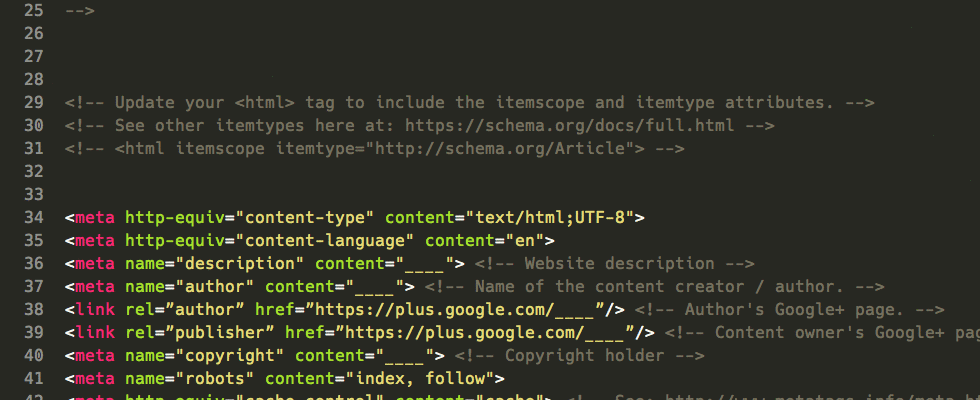

# Ultimate MetaTags (with OpenGraph Data)

A large snippet for your page's ``<head>`` that includes all the meta tags you'll need for OPTIMAL sharing and SEO. Extensive work has been put into ensuring you have the optimal images for the most important social media platforms.

### Websites and Social media sites covered by this file.
* Generic
* Google / Google+
* Facebook
* Twitter
* Linkedin
* Pinterest

[View the file](https://github.com/JayHoltslander/ultimate-metatags/blob/master/index.html)

## Testing:
* Twitter: https://dev.twitter.com/docs/cards/validation/validator
* Facebook: https://developers.facebook.com/tools/debug
* Google: http://www.google.com/webmasters/tools/richsnippets
* Pinterest: http://developers.pinterest.com/rich_pins/validator/
* Google Structured Data: https://developers.google.com/structured-data/testing-tool/

## Sources:
* https://moz.com/blog/meta-data-templates-123
* https://blog.bufferapp.com/ideal-image-sizes-social-media-posts
* https://blog.bufferapp.com/ideal-image-sizes-social-media-posts#linkedin
* https://developers.facebook.com/docs/sharing/best-practices
* https://dev.twitter.com/cards/getting-started
* http://havecamerawilltravel.com/photographer/images-photos-facebook-sizes-dimensions-types
* https://blog.bufferapp.com/ideal-image-sizes-social-media-posts#pinterest
* http://www.iacquire.com/blog/18-meta-tags-every-webpage-should-have-in-2013
* http://www.metatags.info

## Further resources
* http://ogp.me

### Keywords
meta, metatags, Opengraph, Structured Data, itemscope, itemtype, meta, property, og, itemprop, favicon, favicons, head, name, property, author, publisher, robots, title, site description, keywords, SEO, image, height, width

____

## KING SEO ( +ADD by : author : Madjeek - 18/06/2022 )

